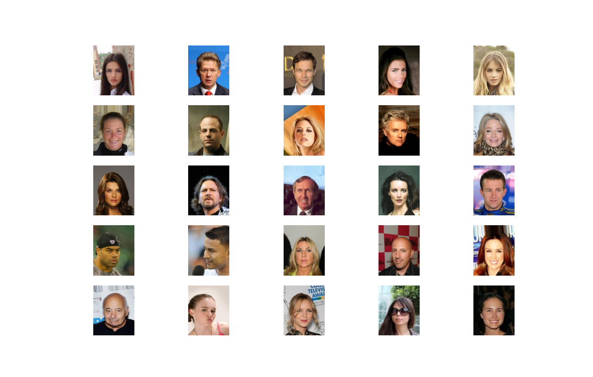
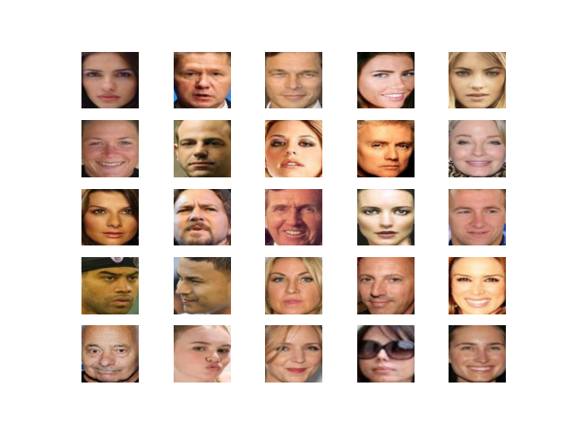
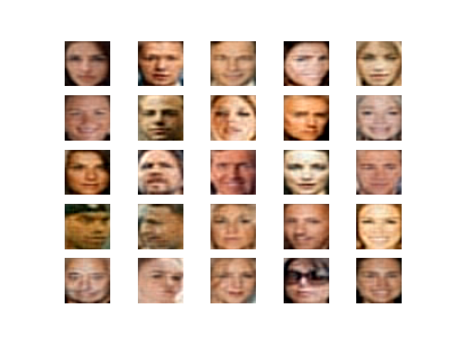
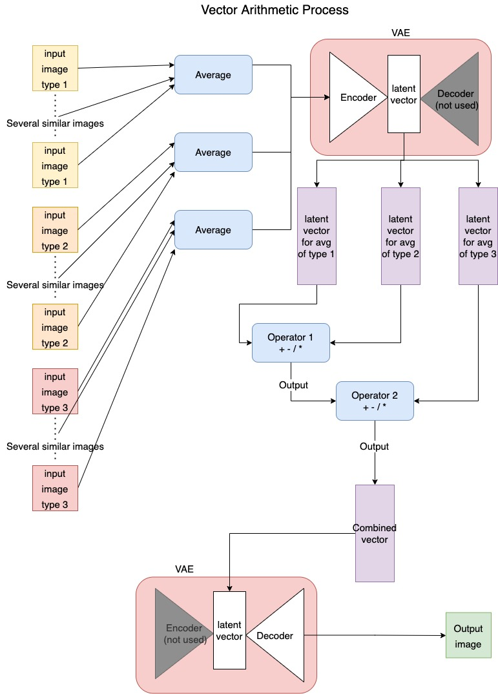

## Building an accordion AE to retry experiment from last week
### Accordion V1
```python
Model: "model"
_________________________________________________________________
Layer (type)                 Output Shape              Param #
=================================================================
input_1 (InputLayer)         [(None, 128, 128, 3)]     0
_________________________________________________________________
conv2d (Conv2D)              (None, 64, 64, 128)       3584
_________________________________________________________________
conv2d_1 (Conv2D)            (None, 32, 32, 128)       147584
_________________________________________________________________
conv2d_2 (Conv2D)            (None, 16, 16, 256)       295168
_________________________________________________________________
batch_normalization (BatchNo (None, 16, 16, 256)       1024
_________________________________________________________________
conv2d_transpose (Conv2DTran (None, 32, 32, 128)       295040
_________________________________________________________________
conv2d_transpose_1 (Conv2DTr (None, 64, 64, 64)        73792
_________________________________________________________________
conv2d_transpose_2 (Conv2DTr (None, 128, 128, 3)       1731
_________________________________________________________________
conv2d_3 (Conv2D)            (None, 64, 64, 128)       3584
_________________________________________________________________
conv2d_4 (Conv2D)            (None, 32, 32, 128)       147584
_________________________________________________________________
conv2d_5 (Conv2D)            (None, 16, 16, 256)       295168
_________________________________________________________________
batch_normalization_1 (Batch (None, 16, 16, 256)       1024
_________________________________________________________________
conv2d_transpose_3 (Conv2DTr (None, 32, 32, 128)       295040
_________________________________________________________________
conv2d_transpose_4 (Conv2DTr (None, 64, 64, 64)        73792
_________________________________________________________________
conv2d_transpose_5 (Conv2DTr (None, 128, 128, 3)       1731
=================================================================
Total params: 1,635,846
Trainable params: 1,634,822
Non-trainable params: 1,024
_________________________________________________________________
```

- Blocking effect seems to be happening.
- After testing new architecture, it does not seem to help much with reducing blury output.

## Using CelebA dataset for vector arithmetic
### Dataset sample

### Preprocessing
To increase model performance, only the faces in each image were extracted using a pre-trained Multi-Task Cascaded Convolutional Neural Network (MTCNN).
Below are the same faces as above, but only the face extracted.


## VAE Model for vector arithmetic
Note: The model from the article is a GAN, I chose to use a VAE to keep our experiments more consistent with the 'autoencoder' structure.
### VAE Version 1
#### Encoder
```python
Model: "model"
__________________________________________________________________________________________________
Layer (type)                    Output Shape         Param #     Connected to
==================================================================================================
input_1 (InputLayer)            [(None, 80, 80, 3)]  0
__________________________________________________________________________________________________
conv2d (Conv2D)                 (None, 40, 40, 128)  3584        input_1[0][0]
__________________________________________________________________________________________________
conv2d_1 (Conv2D)               (None, 20, 20, 64)   73792       conv2d[0][0]
__________________________________________________________________________________________________
conv2d_2 (Conv2D)               (None, 10, 10, 32)   18464       conv2d_1[0][0]
__________________________________________________________________________________________________
conv2d_3 (Conv2D)               (None, 5, 5, 16)     4624        conv2d_2[0][0]
__________________________________________________________________________________________________
batch_normalization (BatchNorma (None, 5, 5, 16)     64          conv2d_3[0][0]
__________________________________________________________________________________________________
flatten (Flatten)               (None, 400)          0           batch_normalization[0][0]
__________________________________________________________________________________________________
dense (Dense)                   (None, 256)          102656      flatten[0][0]
__________________________________________________________________________________________________
dense_1 (Dense)                 (None, 256)          102656      flatten[0][0]
__________________________________________________________________________________________________
lambda (Lambda)                 (None, 256)          0           dense[0][0]
                                                                 dense_1[0][0]
==================================================================================================
Total params: 305,840
Trainable params: 305,808
Non-trainable params: 32
```
#### Decoder
```python
Model: "model_1"
_________________________________________________________________
Layer (type)                 Output Shape              Param #
=================================================================
input_2 (InputLayer)         [(None, 256)]             0
_________________________________________________________________
intermediate_decoder (Dense) (None, 400)               102800
_________________________________________________________________
reshape (Reshape)            (None, 5, 5, 16)          0
_________________________________________________________________
conv2d_transpose (Conv2DTran (None, 10, 10, 32)        4640
_________________________________________________________________
conv2d_transpose_1 (Conv2DTr (None, 20, 20, 64)        18496
_________________________________________________________________
conv2d_transpose_2 (Conv2DTr (None, 40, 40, 128)       73856
_________________________________________________________________
conv2d_transpose_3 (Conv2DTr (None, 80, 80, 3)         3459
=================================================================
Total params: 203,251
Trainable params: 203,251
Non-trainable params: 0
```
## VAE Reconstruction results
The result here is better than I expected for a VAE of this size, output was expected to be blurry, but one can make out who the face is. It might be worth using a GAN for future experiments as that's what was used in the article.

## Vector Arithmetic process


For my vector arithmetic equation, I chose to use the same equation as the article.

`smiling woman - neutral woman + neutral man = smiling man`

## Sources
- https://machinelearningmastery.com/how-to-interpolate-and-perform-vector-arithmetic-with-faces-using-a-generative-adversarial-network/

