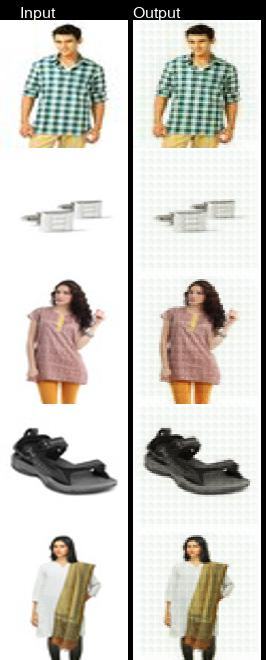

## Building an accordion AE to retry experiment from last week
### Accordion V1
```python
Model: "model"
_________________________________________________________________
Layer (type)                 Output Shape              Param #
=================================================================
input_1 (InputLayer)         [(None, 128, 128, 3)]     0
_________________________________________________________________
conv2d (Conv2D)              (None, 64, 64, 128)       3584
_________________________________________________________________
conv2d_1 (Conv2D)            (None, 32, 32, 128)       147584
_________________________________________________________________
conv2d_2 (Conv2D)            (None, 16, 16, 256)       295168
_________________________________________________________________
batch_normalization (BatchNo (None, 16, 16, 256)       1024
_________________________________________________________________
conv2d_transpose (Conv2DTran (None, 32, 32, 128)       295040
_________________________________________________________________
conv2d_transpose_1 (Conv2DTr (None, 64, 64, 64)        73792
_________________________________________________________________
conv2d_transpose_2 (Conv2DTr (None, 128, 128, 3)       1731
_________________________________________________________________
conv2d_3 (Conv2D)            (None, 64, 64, 128)       3584
_________________________________________________________________
conv2d_4 (Conv2D)            (None, 32, 32, 128)       147584
_________________________________________________________________
conv2d_5 (Conv2D)            (None, 16, 16, 256)       295168
_________________________________________________________________
batch_normalization_1 (Batch (None, 16, 16, 256)       1024
_________________________________________________________________
conv2d_transpose_3 (Conv2DTr (None, 32, 32, 128)       295040
_________________________________________________________________
conv2d_transpose_4 (Conv2DTr (None, 64, 64, 64)        73792
_________________________________________________________________
conv2d_transpose_5 (Conv2DTr (None, 128, 128, 3)       1731
=================================================================
Total params: 1,635,846
Trainable params: 1,634,822
Non-trainable params: 1,024
_________________________________________________________________
```

- Blocking effect seems to be happening.

