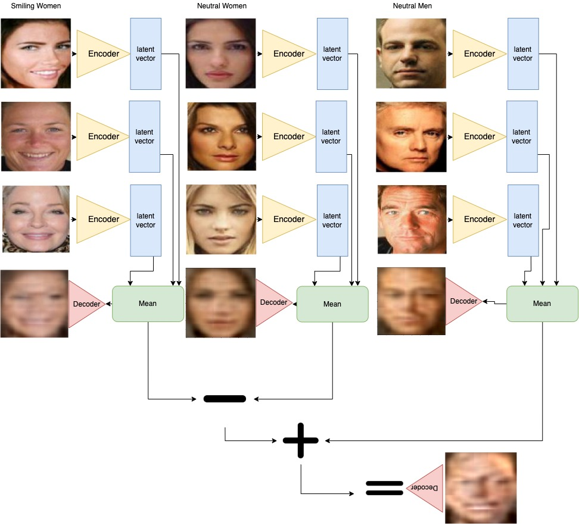
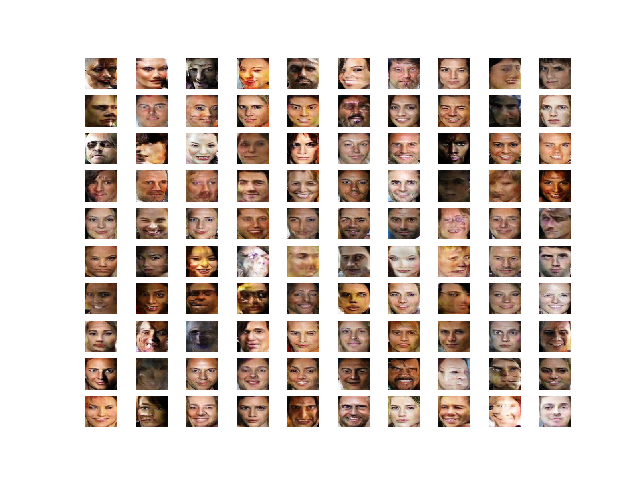
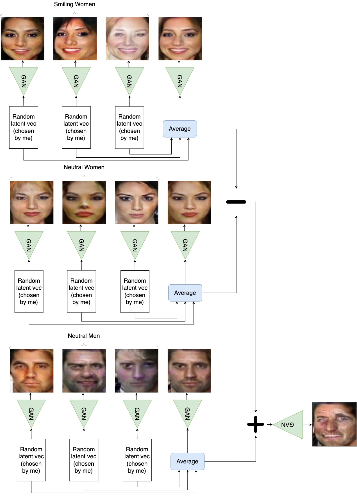
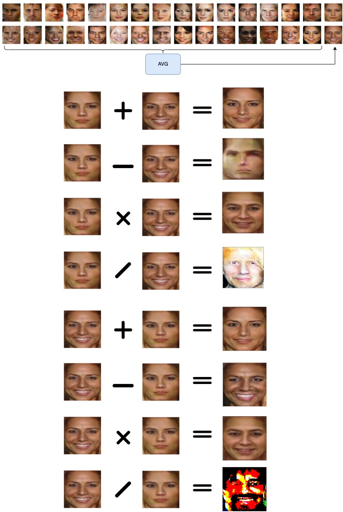
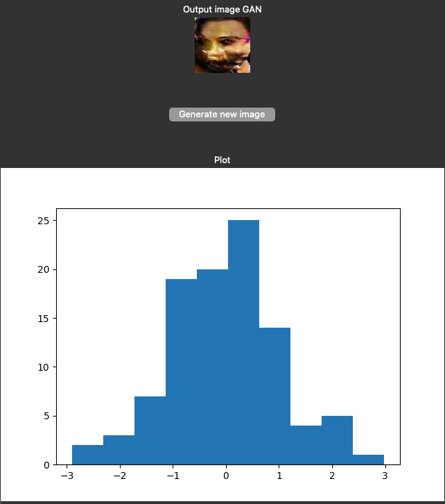

## Retry vector arithmetic VAE using averages of latent variables

- Result seems very similar to last week's.
- Average images seem to have the correct features though. Not overlapping faces.
- Images are extra blurry if latent space is averaged.

## Review on GAN

- Notice the latent space of a GAN is only loosely related to the input data from the training process. Weights get adjusted to construct an image that resembles a real world image.
- The generator turns random noise into images.
- Latent space is not created from input image.
- Images that come out of the generator model don't necessarily resemble the dataset.

## Building the baseline model
#### Generator model

```python
Model: "sequential_1"
_________________________________________________________________
Layer (type)                 Output Shape              Param #
=================================================================
dense_1 (Dense)              (None, 3200)              323200
_________________________________________________________________
leaky_re_lu_5 (LeakyReLU)    (None, 3200)              0
_________________________________________________________________
reshape (Reshape)            (None, 5, 5, 128)         0
_________________________________________________________________
conv2d_transpose (Conv2DTran (None, 10, 10, 128)       262272
_________________________________________________________________
leaky_re_lu_6 (LeakyReLU)    (None, 10, 10, 128)       0
_________________________________________________________________
conv2d_transpose_1 (Conv2DTr (None, 20, 20, 128)       262272
_________________________________________________________________
leaky_re_lu_7 (LeakyReLU)    (None, 20, 20, 128)       0
_________________________________________________________________
conv2d_transpose_2 (Conv2DTr (None, 40, 40, 128)       262272
_________________________________________________________________
leaky_re_lu_8 (LeakyReLU)    (None, 40, 40, 128)       0
_________________________________________________________________
conv2d_transpose_3 (Conv2DTr (None, 80, 80, 128)       262272
_________________________________________________________________
leaky_re_lu_9 (LeakyReLU)    (None, 80, 80, 128)       0
_________________________________________________________________
conv2d_5 (Conv2D)            (None, 80, 80, 3)         9603
=================================================================
Total params: 1,381,891
Trainable params: 1,381,891
Non-trainable params: 0
_________________________________________________________________
```

#### Discriminator model

```python
Model: "sequential"
_________________________________________________________________
Layer (type)                 Output Shape              Param #
=================================================================
conv2d (Conv2D)              (None, 80, 80, 128)       9728
_________________________________________________________________
leaky_re_lu (LeakyReLU)      (None, 80, 80, 128)       0
_________________________________________________________________
conv2d_1 (Conv2D)            (None, 40, 40, 128)       409728
_________________________________________________________________
leaky_re_lu_1 (LeakyReLU)    (None, 40, 40, 128)       0
_________________________________________________________________
conv2d_2 (Conv2D)            (None, 20, 20, 128)       409728
_________________________________________________________________
leaky_re_lu_2 (LeakyReLU)    (None, 20, 20, 128)       0
_________________________________________________________________
conv2d_3 (Conv2D)            (None, 10, 10, 128)       409728
_________________________________________________________________
leaky_re_lu_3 (LeakyReLU)    (None, 10, 10, 128)       0
_________________________________________________________________
conv2d_4 (Conv2D)            (None, 5, 5, 128)         409728
_________________________________________________________________
leaky_re_lu_4 (LeakyReLU)    (None, 5, 5, 128)         0
_________________________________________________________________
flatten (Flatten)            (None, 3200)              0
_________________________________________________________________
dropout (Dropout)            (None, 3200)              0
_________________________________________________________________
dense (Dense)                (None, 1)                 3201
=================================================================
Total params: 1,651,841
Trainable params: 1,651,841
Non-trainable params: 0
_________________________________________________________________
```


#### Entire model

```python
Model: "sequential_2"
_________________________________________________________________
Layer (type)                 Output Shape              Param #
=================================================================
sequential_1 (Sequential)    (None, 80, 80, 3)         1381891
_________________________________________________________________
sequential (Sequential)      (None, 1)                 1651841
=================================================================
Total params: 3,033,732
Trainable params: 1,381,891
Non-trainable params: 1,651,841
_________________________________________________________________
```

To train this model, performance was evaluated every 10 epochs. It is possible
to overtrain GANs, so the training process generated an image like the one below
every 10 epochs. The best image was then selected. The image below is after 40
epochs.


- Generated faces of GANs look creepy. I think this is because humans know exactly what faces should look like, and any slight deviations trigger a threat response.
- Most faces have all the correct features: (2 eyes, nose, mouth, somewhat normal shape)

## Vector arithmetic using the baseline model

`Smiling woman - Neutral woman + Neutral man = Smiling man`



- Result is definately better than VAE.
- Output of GAN is not blurry.



## Potential performance improvements
- Some noise (100 random normal points) generates bad images.
Example bad image:

- What type of noise generates good images?
- Perhaps we can use the discriminator model to determine if the image is good or not?
- Maybe we can try to get the generator model to recreate images from the dataset by trying many different latent vectors and seeing which one is the closest. Then maybe train an encoder model to create those vectors based on a given image from the dataset.
    - I tried with without much luck
- Can we classify noise that will yield a 'real' image from the generator versus noise that will yield a fake image?
