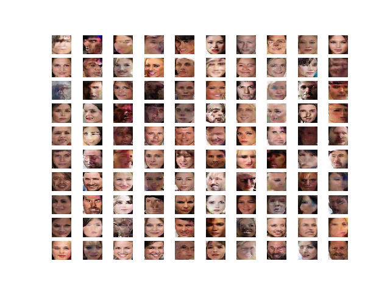
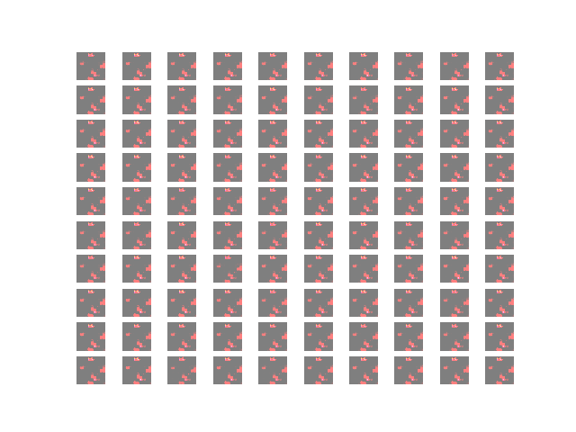

## Performance metrics
- blur
- discriminator loss/accuracy 'real'
- discriminator loss/accuracy 'fake'
- generator loss/accuracy
- Number of parameters (trainable and Non-trainable)
Anything else?

## GAN training process
1. Train discriminator on 1/2 batch 'real' inputs.
2. Train discriminator on 1/2 batch 'fake' inputs.
3. Train GAN on 1 batch, but discriminator weights are marked 'Non-trainable'. This results in the generator's weights getting updated.
4. Repeat

## Testing Different (smaller) GAN architectures

In this model, number of filters for conv2d\_transpose layers were changed from 128 to 100.

```python
Model: "sequential_1"
_________________________________________________________________
Layer (type)                 Output Shape              Param #
=================================================================
dense_1 (Dense)              (None, 2500)              252500
_________________________________________________________________
leaky_re_lu_5 (LeakyReLU)    (None, 2500)              0
_________________________________________________________________
reshape (Reshape)            (None, 5, 5, 100)         0
_________________________________________________________________
conv2d_transpose (Conv2DTran (None, 10, 10, 100)       160100
_________________________________________________________________
leaky_re_lu_6 (LeakyReLU)    (None, 10, 10, 100)       0
_________________________________________________________________
conv2d_transpose_1 (Conv2DTr (None, 20, 20, 100)       160100
_________________________________________________________________
leaky_re_lu_7 (LeakyReLU)    (None, 20, 20, 100)       0
_________________________________________________________________
conv2d_transpose_2 (Conv2DTr (None, 40, 40, 100)       160100
_________________________________________________________________
leaky_re_lu_8 (LeakyReLU)    (None, 40, 40, 100)       0
_________________________________________________________________
conv2d_transpose_3 (Conv2DTr (None, 80, 80, 100)       160100
_________________________________________________________________
leaky_re_lu_9 (LeakyReLU)    (None, 80, 80, 100)       0
_________________________________________________________________
conv2d_5 (Conv2D)            (None, 80, 80, 3)         7503
=================================================================
Total params: 900,403
Trainable params: 900,403
Non-trainable params: 0
_________________________________________________________________
```
- Model is 65% the size of the baseline model.


---

In this model, 2 conv2d\_transpose layers were removed. Number of filters changed from 128 to 100.
```python
Model: "sequential_1"
_________________________________________________________________
Layer (type)                 Output Shape              Param #
=================================================================
dense_1 (Dense)              (None, 2500)              252500
_________________________________________________________________
leaky_re_lu_5 (LeakyReLU)    (None, 2500)              0
_________________________________________________________________
reshape (Reshape)            (None, 5, 5, 100)         0
_________________________________________________________________
conv2d_transpose (Conv2DTran (None, 20, 20, 100)       160100
_________________________________________________________________
leaky_re_lu_6 (LeakyReLU)    (None, 20, 20, 100)       0
_________________________________________________________________
conv2d_transpose_1 (Conv2DTr (None, 80, 80, 100)       160100
_________________________________________________________________
leaky_re_lu_7 (LeakyReLU)    (None, 80, 80, 100)       0
_________________________________________________________________
conv2d_5 (Conv2D)            (None, 80, 80, 3)         7503
=================================================================
Total params: 580,203
Trainable params: 580,203
Non-trainable params: 0
_________________________________________________________________
```
- Model is 42% the size of the baeline model.


### Training failure example?

- Not really sure why everything turned green, but I thought it was interesting.

## VAE-GAN

**After attempting to use this architecture, I decided to go with an AE-GAN instead due to it being more simple**

## AE-GAN

### AE-GAN Convergence Failure?
Epoch 10

Epoch 20

Epoch 30

Epoch 40

Epoch 50

Epoch 60

Epoch 70

Epoch 80

Epoch 90

Epoch 100


> Typically, a neural network fails to converge when the model loss does not settle down during the training process. In the case of a GAN, a failure to converge refers to not finding an equilibrium between the discriminator and the generator.
- Loss of the discriminator has gone to 0, and stays there.
- Generator loss steadily rises over time.
> This type of loss is most commonly caused by the generator outputting garbage images that the discriminator can easily identify.
```python
Epoch, batch, discriminator loss 'real', discriminator loss 'fake', generator loss
>100, 350/390, d1=0.000, d2=0.000 g=3969.650
>100, 351/390, d1=0.000, d2=0.000 g=4073.821
>100, 352/390, d1=0.000, d2=0.000 g=3957.396
>100, 353/390, d1=0.000, d2=0.000 g=4028.773
>100, 354/390, d1=0.000, d2=0.000 g=4012.157
>100, 355/390, d1=0.000, d2=0.000 g=3974.358
>100, 356/390, d1=0.000, d2=0.000 g=4015.348
>100, 357/390, d1=0.000, d2=0.000 g=4000.741
>100, 358/390, d1=0.000, d2=0.000 g=3976.813
>100, 359/390, d1=0.000, d2=0.000 g=4044.082
>100, 360/390, d1=0.000, d2=0.000 g=4045.718
>100, 361/390, d1=0.000, d2=0.000 g=4030.518
>100, 362/390, d1=0.000, d2=0.000 g=3981.260
>100, 363/390, d1=0.000, d2=0.000 g=4023.841
>100, 364/390, d1=0.000, d2=0.000 g=4037.833
>100, 365/390, d1=0.000, d2=0.000 g=3964.532
>100, 366/390, d1=0.000, d2=0.000 g=4033.472
>100, 367/390, d1=0.000, d2=0.000 g=4026.272
>100, 368/390, d1=0.000, d2=0.000 g=4095.623
>100, 369/390, d1=0.000, d2=0.000 g=4043.215
>100, 370/390, d1=0.000, d2=0.000 g=3948.164
>100, 371/390, d1=0.000, d2=0.000 g=3994.030
>100, 372/390, d1=0.000, d2=0.000 g=4105.486
>100, 373/390, d1=0.000, d2=0.000 g=4081.369
>100, 374/390, d1=0.000, d2=0.000 g=4040.253
>100, 375/390, d1=0.000, d2=0.000 g=4031.456
>100, 376/390, d1=0.000, d2=0.000 g=4037.990
>100, 377/390, d1=0.000, d2=0.000 g=3988.677
>100, 378/390, d1=0.000, d2=0.000 g=4049.035
>100, 379/390, d1=0.000, d2=0.000 g=3993.023
>100, 380/390, d1=0.000, d2=0.000 g=4087.639
>100, 381/390, d1=0.000, d2=0.000 g=4030.921
>100, 382/390, d1=0.000, d2=0.000 g=4005.591
>100, 383/390, d1=0.000, d2=0.000 g=4033.066
>100, 384/390, d1=0.000, d2=0.000 g=3920.520
>100, 385/390, d1=0.000, d2=0.000 g=3939.916
>100, 386/390, d1=0.000, d2=0.000 g=4079.210
>100, 387/390, d1=0.000, d2=0.000 g=4078.109
>100, 388/390, d1=0.000, d2=0.000 g=4075.279
>100, 389/390, d1=0.000, d2=0.000 g=4007.191
>100, 390/390, d1=0.000, d2=0.000 g=4009.323
>Accuracy real: 100%, fake: 100%
```
## New Proposed AE-GAN training process
1. Train discriminator on 1/2 batch 'real' inputs.
2. Train AE on 1/2 batch, input is real image, output is reconstructed image, loss is reconstruction loss.
3. Train discriminator on 1/2 batch 'fake' (reconstructed) inputs.
4. Train GAN on 1 batch, but discriminator weights are marked 'Non-trainable'. This results in the generator's weights getting updated.
5. Repeat
- By adding the 1/2 batch training on the AE, I'm hoping it will reduce the chance of convergence failure due to some prior training at reconstruction. It might be able to fool the discriminator a little better.
I tried doing this, however, I'm having trouble because the generator model needs to not be compiled
for step 5, but must be compiled for step 2. I think this is an area where my tensorflow knowledge is limiting and I could use some help figuring out how to do that.

## Conclusion
- If we want to continue to pursue this AE-GAN idea, we need to simplify the problem.
    - MNIST: Single digit?

- Got good results on GAN size reductions. No convergence failure observed.
    - Could continue to reduce the size until convergence failure.

## Currently working on
- Test script to get metrics on each model. See [Performance metrics](#performance-metrics) section
- Getting new AE-GAN training process to work.
- Training a new AE-GAN model with an AE that more closely resembles the baseline generator.
- Changing the baseline GAN model to have a generator with a latent space.
## Sources
- https://machinelearningmastery.com/practical-guide-to-gan-failure-modes/
