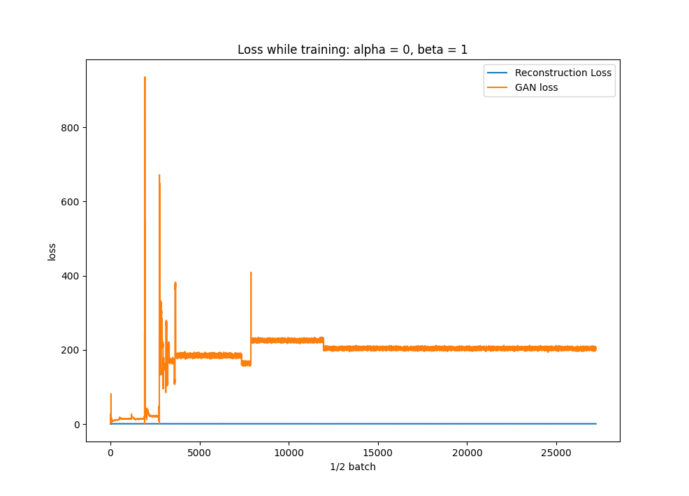
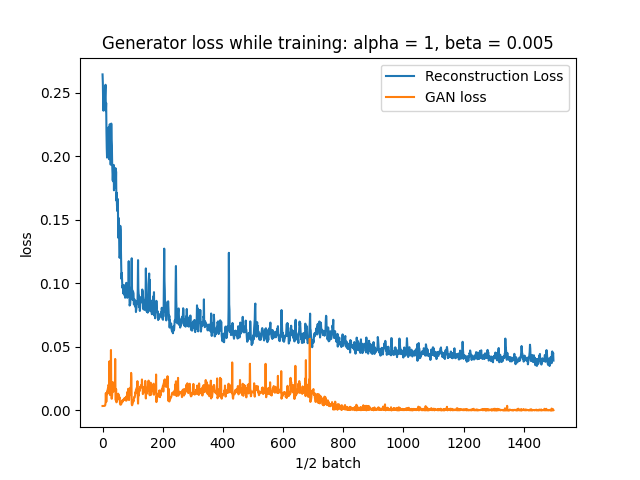

### Overriding the training function in Sequential model
__Problem__:
- Need to access output of generator during the GAN training process. Typically, only have access to the output of the discriminator.
- Need access to the input data `x` during training to measure the reconstruction loss.
__Solution__:
- Wrap loss function in function that takes the generator, as well as alpha and beta as parameters.
```python
def loss_wapper(g_model, alpha, beta):
    mse = MeanSquaredError()
    bce = BinaryCrossentropy(from_logits=True)

    def loss(x, y_true, y_pred):
        y = g_model(x)
        ae_loss = tf.math.scalar_mul(alpha, mse(x, y))
        gan_loss = tf.math.scalar_mul(beta, bce(y_true, y_pred))
        # Here is where I plotted the ae_loss and gan_loss values in order to tune alpha and beta
        return ae_loss + gan_loss

    return loss
```

- Override train_step function in Sequential model to call loss function with the input data `x`.
*Note*: `my_loss` gets set to the loss function above.
```python
class VAEGAN(tf.keras.Sequential):
    def compile(self, optimizer, my_loss, run_eagerly=True):
        super().compile(optimizer, run_eagerly=True)
        self.my_loss = my_loss

    def train_step(self, data):
        x, y, sample_weight = data_adapter.unpack_x_y_sample_weight(data)

        with tf.GradientTape() as tape:
            y_pred = self(x, training=True)
            loss_value = self.my_loss(x, y, y_pred)

        grads = tape.gradient(loss_value, self.trainable_variables)
        self.optimizer.apply_gradients(zip(grads, self.trainable_variables))

        return {"loss": loss_value}
```
*Note*: eager execution allows access to the tensors (for debugging) inside the loss function. So I was able to print out and display values and stuff like that.

## Note on learning rate
- If loss is unstable (going up and down violently).
- Need to reduce learning rate.
- Gradient descent is taking too large of steps, and jumping out of the minima.

## Verification of loss function
### Verification test 1
- If alpha = 1 and beta = 0, should get same result as training a typical autoencoder. This is because the loss will be only the reconstruction loss, and only depend on X and output of the generator (AE) y.

*Note*: this output is the model trained at 23 epochs.

*Note*: Since beta = 0, the GAN loss has no effect on the model's training.

This is the same graph as above, but GAN loss is multiplied by 0.005.


- Looks like the result of training a typical autoencoder, so I think it's working for that part of the loss function.
- Learning rate could be reduced.

#### Below is the training evolution over 36 epochs.


### Verification test 2
- If alpha = 0 and beta = 1, should get same result as training a typical GAN. Although, with the caveat of the generator being autoencoder shaped. So results from this test may be varied.
- This test will likely result in failure to converge because the generator is shaped like an autoencoder not a typical GAN generator. GANs can be pretty sensitive to changes in network architecture.
- I'm hoping the combination between alpha and beta will allow the discriminator to be fooled and prevent convergence failure.


#### Below is the training evolution over 69 epochs.


## Test using alpha = 1, beta = 0.005
- Learning rate reduced to 0.0001 (was 0.0002). I'm hoping this will provide better performance and reduce training time due to the volatility of the reconstruction loss.


Below is the same graph, but zoomed out. Notice the spike, then recovery? AE loss seems to keep GAN loss under control, potentially causing the network to recover from convergence failure?


## Test using a pre-trained AE as a generator to the GAN
Steps:
- Train AE to reconstruct images from the original dataset.
- Train GAN using the pre-trained AE. AE weights will get updated during that process.
Original dataset

Reconstruction after pre-training AE

Result after 100 epochs of training GAN


- Images tend to be the same regardless of the input.
- Using a pre-trained model for the AE seems to disconnect the relation between the input and output of the AE during the GAN training process.
