---

## AE-GAN version 1
### Changes from previous model (test model from last week)
#### New loss function
- Want GAN loss to increase as AE loss decreases.
- Do this by scaling the GAN loss by 1 / AE loss.
- Need 0.0005 scalar multiplier in order to keep GAN loss the same order of magnitude as AE loss.

```python
def loss_wapper(g_model, alpha, beta):
    mse = MeanSquaredError()
    bce = BinaryCrossentropy()

    def loss(x, y_true, y_pred):
        # run data through generator
        y = g_model(x)
        # calculate typical loss functions
        ae = mse(x, y)
        gan = bce(y_true, y_pred)

        # scale ae loss and invert
        ae_loss = tf.math.scalar_mul(alpha, ae)
        ae_loss_inverted = 1 / ae_loss

        # gan_loss should = gan_loss * 0.0005 * (1/ae_loss) Hopefully that will allow recovery from convergence f ailure
        gan_loss_scaled = tf.math.scalar_mul(beta, gan)
        gan_loss = tf.math.multiply(gan_loss_scaled, ae_loss_inverted)
        # record results for analysis
        with open(f"./{MODEL_NAME}/data/alpha_beta_loss_{MODEL_NAME}.csv", "a") as f:
            f.write(f"{ae},{gan}\n")

        return ae_loss + gan_loss

    return loss
```
#### Batch size
- Changed from 128 to 256. This makes 195 batches per epoch since dataset is 50,000 images.

### Results
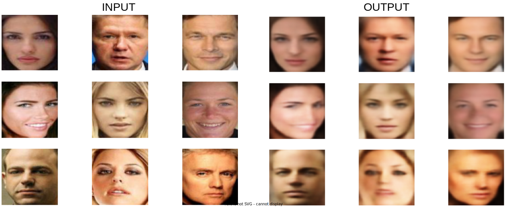
---
---
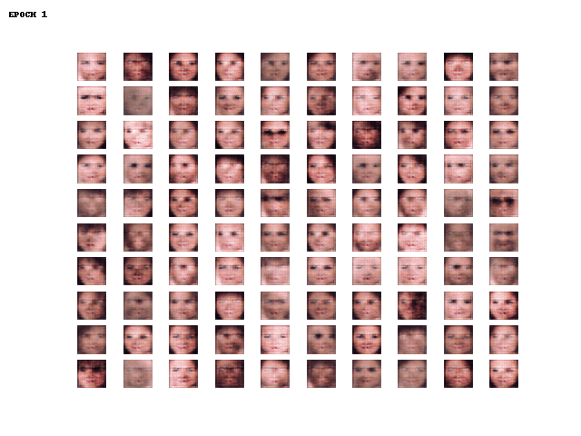

### Observations
- Smiles seem to change slightly. This is probably due to the generative characteristics of the model.
- Faces have slight changes that are not necessarily reconstructions.
- Images are still relatively blury, (see metrics section).

### Data
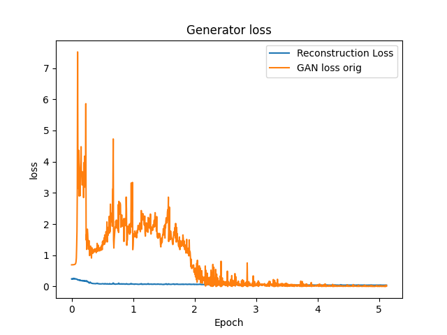
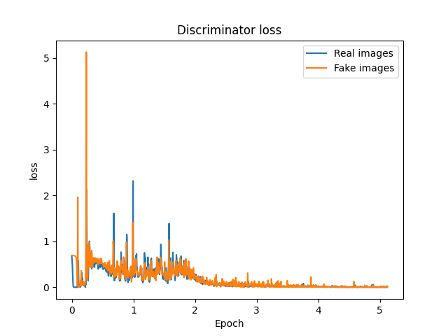
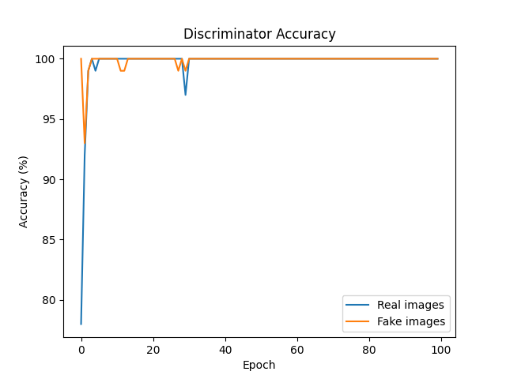

### Vector Arithmetic
__Top row__: smiling women (last column is average latent vector output)

__Middle row__: neutral women

__Bottom row__: neutral men

__Last image__: smiling women - neutral women + neutral man
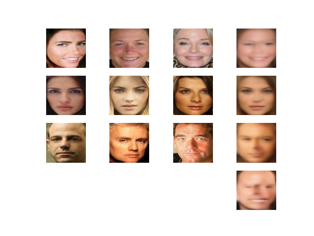

## AE-GAN version 4
### Changes from previous model (version 1)
#### New loss function
The idea behind this loss function was to make the gan loss beta value increase
as the derivative of ae loss approaches 0. As the derivative approaches 0, the
idea is that the ae process is nearing completion the closer the derivative gets
to 0. Additionally, if the derivative becomes positive, the beta scalar will
decrease the same as it increased. The graph below shows a parabolic curve,
representing the ae loss value over time. The purple line is the derivative and
the spiky line is the negative inverse of the derivative. In practice, 'a' (the
inverse scalar value) had to be adjusted to tune the steepness of the curve.

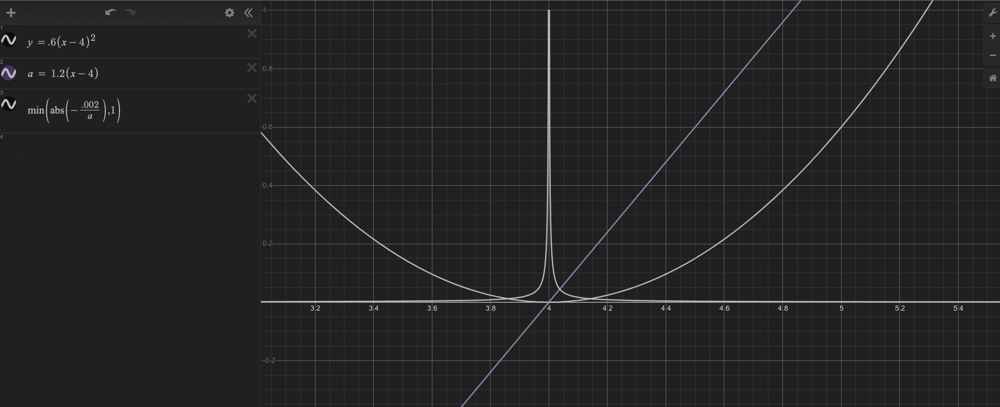

```python
def loss_wapper(g_model, alpha):
    mse = MeanSquaredError()
    bce = BinaryCrossentropy()

    def loss(x, y_true, y_pred):
        # run data through generator
        y = g_model(x)
        # calculate typical loss functions
        ae = mse(x, y)
        gan = bce(y_true, y_pred)

        # Read previously stored loss data
        df = pd.read_csv(f"./{MODEL_NAME}/data/alpha_beta_loss_{MODEL_NAME}.csv")
        beta = 0
        # calculate derivative over the last 50 batches
        if len(df.index) > 50:
            derivative = df["ae_loss"].diff(periods=50) / df[
                "ae_loss"
            ].index.to_series().diff(periods=50)
            # calculate scaled negative inverse
            beta_vec = abs(-0.0000002 / derivative)
            # limit max beta to 1
            beta_vec = beta_vec.apply(lambda x: min(x, 1)).fillna(0)
            beta = beta_vec.iloc[-1]

        gan_loss_scaled = tf.math.scalar_mul(beta, gan)
        # record results for analysis
        with open(f"./{MODEL_NAME}/data/alpha_beta_loss_{MODEL_NAME}.csv", "a") as f:
            f.write(f"{ae},{gan},{beta}\n")

        return ae + gan_loss_scaled

    return loss
```

### Results
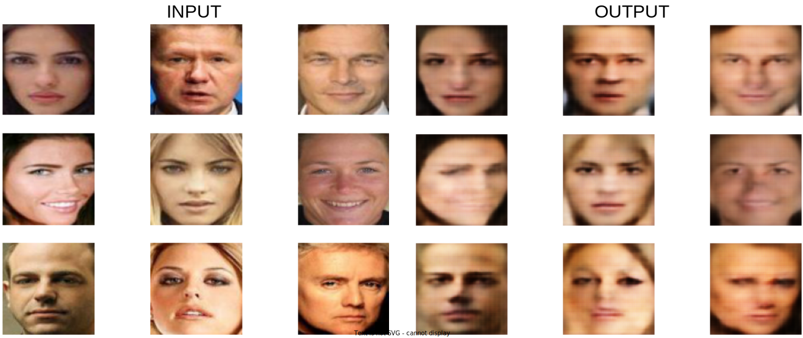
---
---
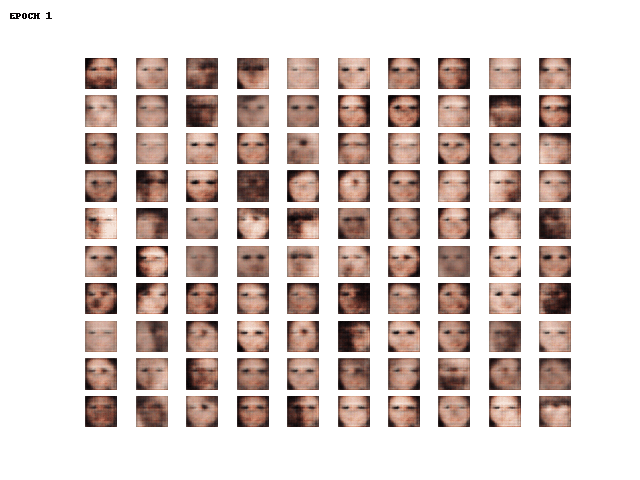

### Observations
- Eyes are much more prominent on these images. I think that is due to the GAN loss being more active in this model.
- Images are still pretty blury.


### Data
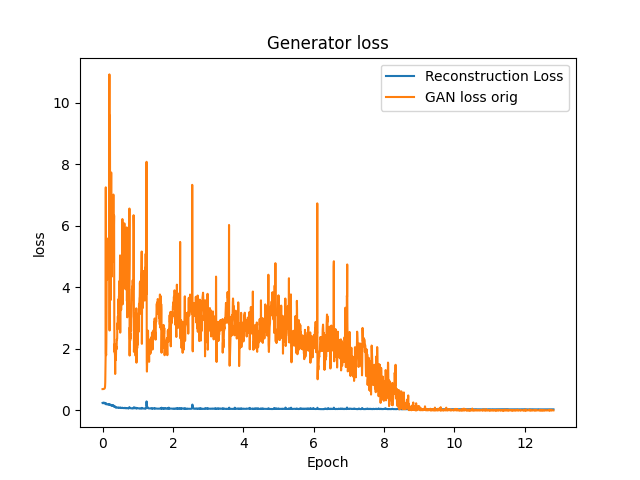
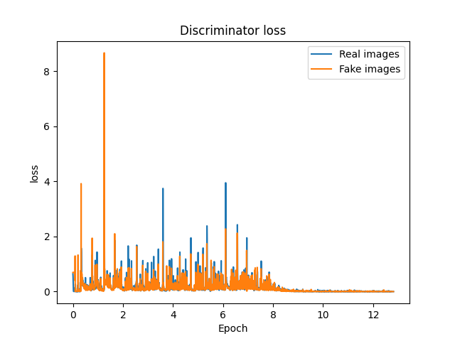
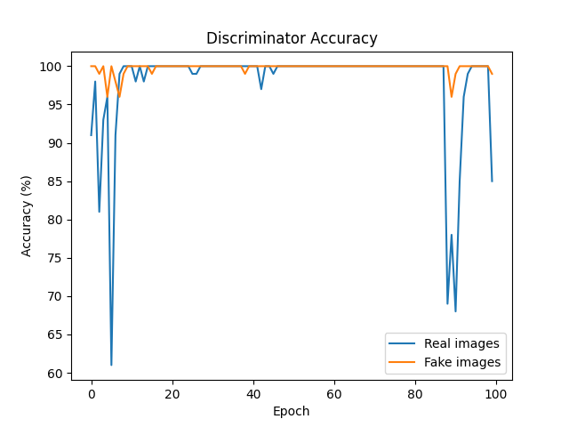


### Vector Arithmetic
__Top row__: smiling women (last column is average latent vector output)

__Middle row__: neutral women

__Bottom row__: neutral men

__Last image__: smiling women - neutral women + neutral man


## AE-GAN version 5
### Changes from previous model (version 4)
#### New loss function

```python
def loss_wapper(g_model, alpha):
    mse = MeanSquaredError()
    bce = BinaryCrossentropy()

    def loss(x, y_true, y_pred):
        # run data through generator
        y = g_model(x)
        # calculate typical loss functions
        ae = mse(x, y)
        gan = bce(y_true, y_pred)

        gan_ceil = min(ae, gan)

        # record results for analysis
        with open(f"./{MODEL_NAME}/data/alpha_beta_loss_{MODEL_NAME}.csv", "a") as f:
            f.write(f"{ae},{gan}\n")

        return ae + gan_ceil

    return loss
```

### Results
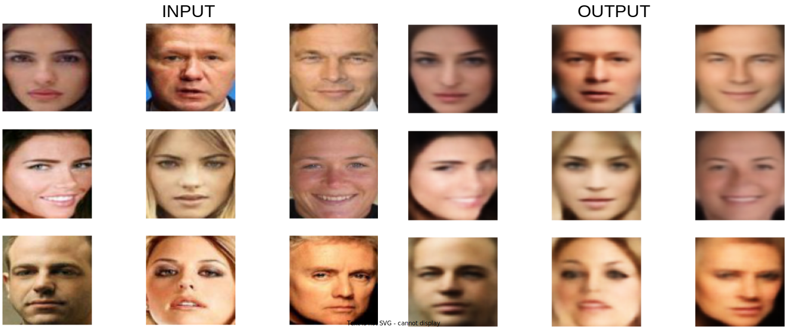
---
---
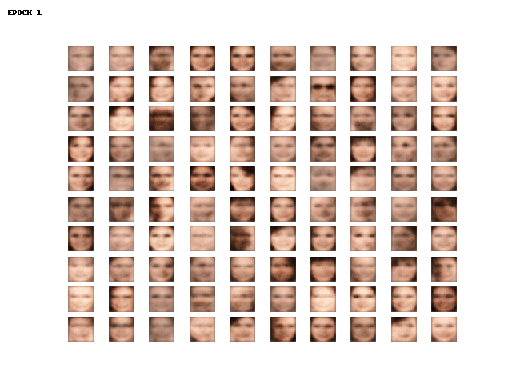

### Observations
- Results are almost identical to the baseline model.

### Data
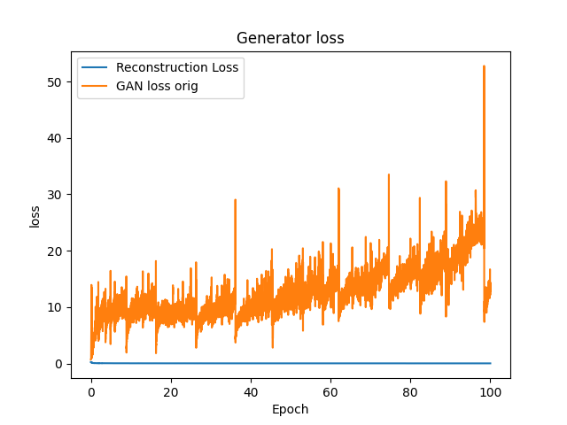
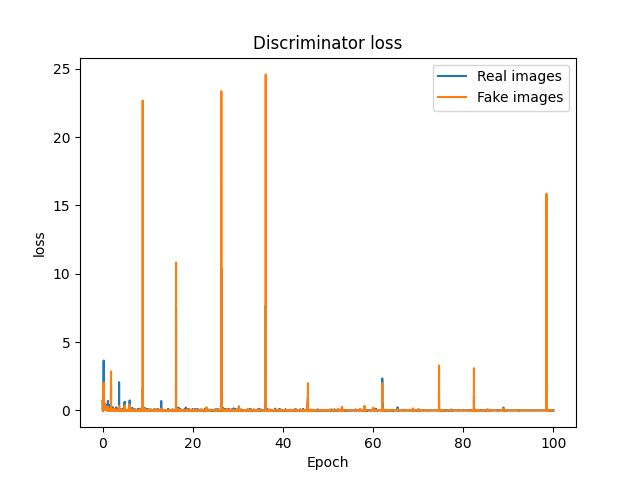
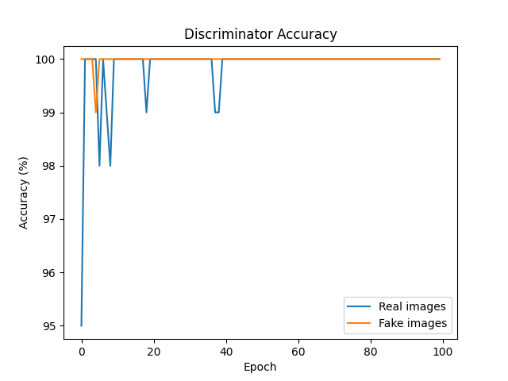


### Vector Arithmetic
__Top row__: smiling women (last column is average latent vector output)

__Middle row__: neutral women

__Bottom row__: neutral men

__Last image__: smiling women - neutral women + neutral man
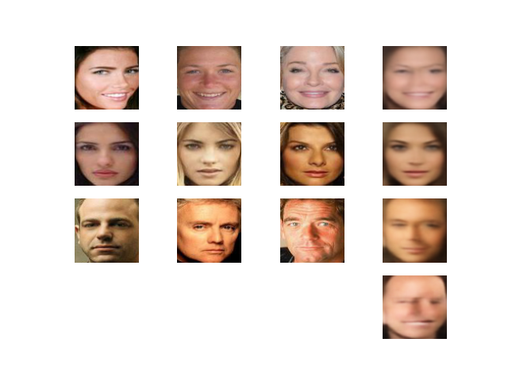

## Metrics
| Metric                                | Baseline             | AE-GAN version 1       | AE-GAN version 4      | AE-GAN version 5     |
| :---                                  |    :----:            |    :----:              |    :----:             |    :----:            |
| Blur factor (dataset raw = 658.269)   | 112.923              | 102.538                | 232.115               | 114.730              |
| Discriminator loss real               | 1.0542e-12           | 4.697e-10              | 2.069e-8              | 1.316e-12            |
| Discriminator loss fake               | 1.308e-9             | 0.0                    | 0.0                   | 1.959e-10            |
| Discriminator accuracy real           | 100%                 | 99.650%                | 97.800%               | 99.870%              |
| Discriminator accuracy fake           | 99.950%              | 99.880%                | 99.800%               | 99.990%              |
| Generator loss                        | 0.694                | 0.017                  | 0.017                 | 0.707                |
| Complexity (trainable/non-trainable)  | 3,222,587 / 1,651,841| 3,222,587 / 1,651,841  | 3,222,587 / 1,651,841 | 3,222,587 / 1,651,841|
| Latent space nodes                    | 100                  | 100                    | 100                   | 100                  |

## Conclusions
