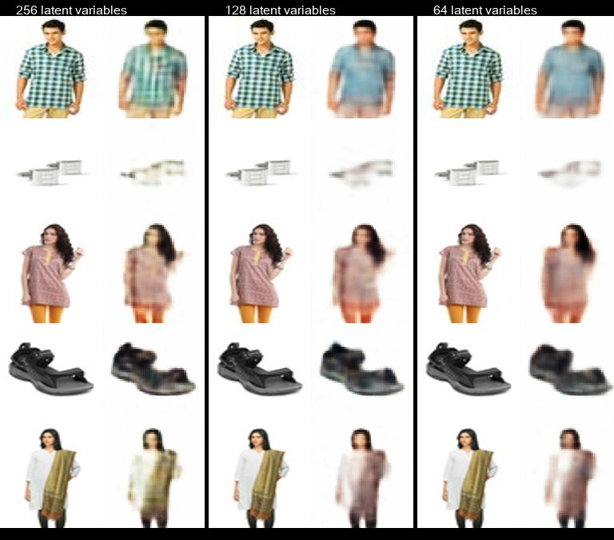
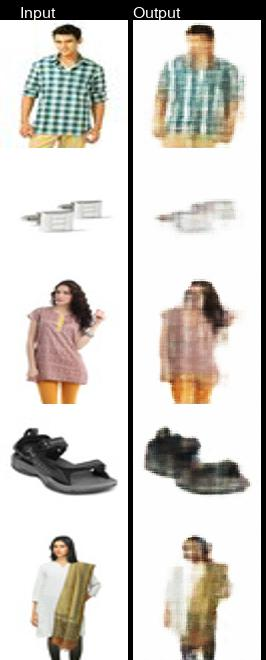
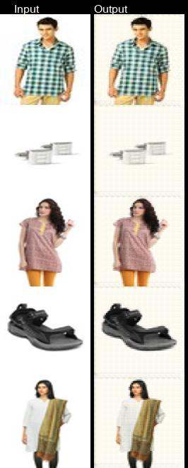
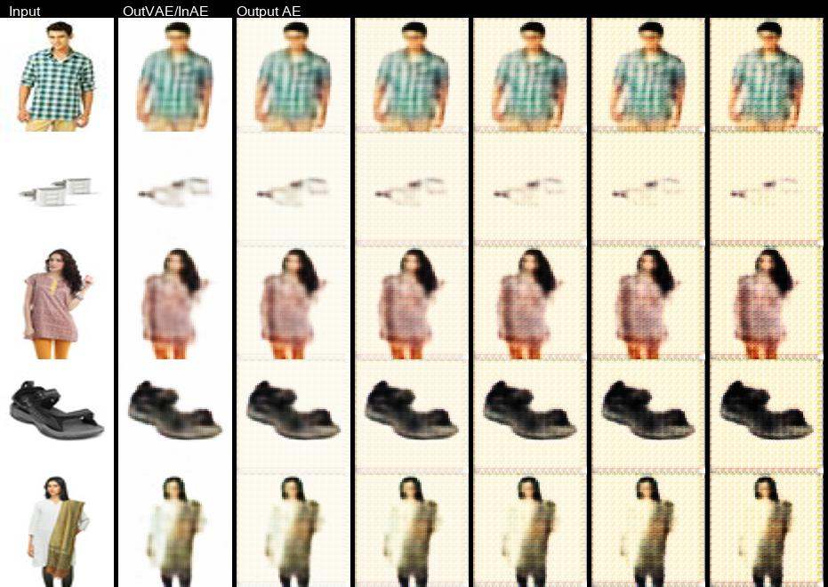

This week, I first began testing smaller latent spaces on the standard VAE
architecture from last week. I then made several attempts at training a standard
autoencoder to only reconstruct images from the dataset in hopes they would be
able to reduce the blury output from the VAE.

## Results of smaller latent spaces using standard VAE

- Images appear to lose definition with smaller latent spaces.
- Interestingly, color changes as well.
- The shirt pattern seems to disappear entirely.
- However, interpolations seem to be much more drastic with fewer latent variables suggesting benefit of using fewer latent variables.

## Training a normal autoencoder to reconstruct the images
#### Version 1:
```python
Model: "model"
_________________________________________________________________
Layer (type)                 Output Shape              Param #
=================================================================
input_1 (InputLayer)         [(None, 128, 128, 3)]     0
_________________________________________________________________
conv2d (Conv2D)              (None, 64, 64, 64)        1792
_________________________________________________________________
max_pooling2d (MaxPooling2D) (None, 32, 32, 64)        0
_________________________________________________________________
conv2d_1 (Conv2D)            (None, 16, 16, 32)        18464
_________________________________________________________________
max_pooling2d_1 (MaxPooling2 (None, 8, 8, 32)          0
_________________________________________________________________
conv2d_transpose (Conv2DTran (None, 16, 16, 32)        9248
_________________________________________________________________
up_sampling2d (UpSampling2D) (None, 32, 32, 32)        0
_________________________________________________________________
conv2d_transpose_1 (Conv2DTr (None, 64, 64, 64)        18496
_________________________________________________________________
up_sampling2d_1 (UpSampling2 (None, 128, 128, 64)      0
_________________________________________________________________
conv2d_2 (Conv2D)            (None, 128, 128, 3)       1731
=================================================================
Total params: 49,731
Trainable params: 49,731
Non-trainable params: 0
_________________________________________________________________
```

- I think max pooling and upsampling is causing the loss in resolution
- Try next version without that, just convolutional layers
- Also add batch normalization layer
> Training deep neural networks with tens of layers is challenging as they can be sensitive to the initial random weights and configuration of the learning algorithm
- Batch normalization helps to standardize inputs to a layer which stabalizes the learning process and should be used for deep neural networks.

## Note on Calculating Output Image Size For Convolutional Layers
- Kernal convolves accross input image
- Filters are last dimension
- Stride of 2 will reduce height and width of input image by half on conv2d layer and double it for cont2d_transpose layer
Here is the formal formula.
```python
output_height = (input_height + padding_height_top + padding_height_bottom - kernel_height) / (stride_height) + 1
output_width = (input_width + padding_width_right + padding_width_left - kernel_width) / (stride_width) + 1
```

#### Version 2:
```python
Model: "model"
_________________________________________________________________
Layer (type)                 Output Shape              Param #
=================================================================
input_1 (InputLayer)         [(None, 128, 128, 3)]     0
_________________________________________________________________
conv2d (Conv2D)              (None, 64, 64, 128)       3584
_________________________________________________________________
conv2d_1 (Conv2D)            (None, 32, 32, 128)       147584
_________________________________________________________________
conv2d_2 (Conv2D)            (None, 16, 16, 256)       295168
_________________________________________________________________
batch_normalization (BatchNo (None, 16, 16, 256)       1024
_________________________________________________________________
conv2d_transpose (Conv2DTran (None, 32, 32, 128)       295040
_________________________________________________________________
conv2d_transpose_1 (Conv2DTr (None, 64, 64, 64)        73792
_________________________________________________________________
conv2d_transpose_2 (Conv2DTr (None, 128, 128, 3)       1731
=================================================================
Total params: 817,923
Trainable params: 817,411
Non-trainable params: 512
_________________________________________________________________
```

- Images seem to have more definition
- Interesting to note: background color changes on pretty much all output images.

## Measuring the blur of an image
- Fast Fourier Transform is an option, examine the distribution of low and high frequencies.
- Another option is variance of the Laplacian. I chose this option because it's simpler, but it may be less accurate than the Fourier method (see demo).
```python
laplacian_kernel = [[0, 1, 0],
                    [1, -4, 1],
                    [0, 1, 0]]
```
- The blur factor is calculated by convolving the laplacian kernel over the image and taking the variance of the new image.
- The laplacian kernel is essentially edge detection (it approximates the 2nd derivative of the image).
- Blurry images have fewer edges.
- Non blurry images have very well defined edges.
- This computation is used in the GUI demo.

## Connecting VAE output to input of standard autoencoder V2
This experiment was done using the previously used VAE architecture (256 latent variables) and the AE version 2. Images were first run though VAE, then output of VAE becomes input to AE.


- Background color change seems to get worse as it's run through the ae multiple times.
- Running output of VAE through AE doesn't seem to help image blur much.

## Building an accordion AE to retry experiment
### Accordion V1
```python
Model: "model"
_________________________________________________________________
Layer (type)                 Output Shape              Param #
=================================================================
input_1 (InputLayer)         [(None, 128, 128, 3)]     0
_________________________________________________________________
conv2d (Conv2D)              (None, 64, 64, 128)       3584
_________________________________________________________________
conv2d_1 (Conv2D)            (None, 32, 32, 128)       147584
_________________________________________________________________
conv2d_2 (Conv2D)            (None, 16, 16, 256)       295168
_________________________________________________________________
batch_normalization (BatchNo (None, 16, 16, 256)       1024
_________________________________________________________________
conv2d_transpose (Conv2DTran (None, 32, 32, 128)       295040
_________________________________________________________________
conv2d_transpose_1 (Conv2DTr (None, 64, 64, 64)        73792
_________________________________________________________________
conv2d_transpose_2 (Conv2DTr (None, 128, 128, 3)       1731
_________________________________________________________________
conv2d_3 (Conv2D)            (None, 64, 64, 128)       3584
_________________________________________________________________
conv2d_4 (Conv2D)            (None, 32, 32, 128)       147584
_________________________________________________________________
conv2d_5 (Conv2D)            (None, 16, 16, 256)       295168
_________________________________________________________________
batch_normalization_1 (Batch (None, 16, 16, 256)       1024
_________________________________________________________________
conv2d_transpose_3 (Conv2DTr (None, 32, 32, 128)       295040
_________________________________________________________________
conv2d_transpose_4 (Conv2DTr (None, 64, 64, 64)        73792
_________________________________________________________________
conv2d_transpose_5 (Conv2DTr (None, 128, 128, 3)       1731
=================================================================
Total params: 1,635,846
Trainable params: 1,634,822
Non-trainable params: 1,024
_________________________________________________________________
```

## Sources
- https://machinelearningmastery.com/batch-normalization-for-training-of-deep-neural-networks/
- https://pyimagesearch.com/2015/09/07/blur-detection-with-opencv/
- J. L. Pech-Pacheco, G. Cristobal, J. Chamorro-Martinez and J. Fernandez-Valdivia, "Diatom autofocusing in brightfield microscopy: a comparative study," Proceedings 15th International Conference on Pattern Recognition. ICPR-2000, 2000, pp. 314-317 vol.3, doi: 10.1109/ICPR.2000.903548.

